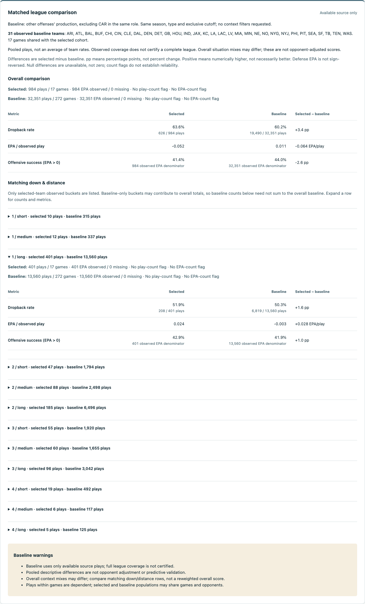

# Local report viewer

The first P1.4 browser slice is a React/TypeScript view of the existing
`GET /v1/report` endpoint, not a new analytics engine. It accepts team, season,
exclusive cutoff, offense/defense and regular/postseason selection. It displays
overall metrics, observed down/distance rows, sample flags, all report warnings,
source timestamps, attribution and fingerprints. An opt-in league comparison adds
observed baseline coverage, side-by-side measurements and matching situation differences.
It never selects a filesystem path, fetches NFL data, or silently falls back to a
synthetic response.


Screenshot captured from the real pinned snapshot via the local Vite proxy and
FastAPI service on 2026-10-09. This is retrospective CAR offense before REG week
19: 984 plays / 17 games, 626 dropbacks, -0.052 displayed EPA/play and 41.4%
displayed offensive success. Source acquisition was in 2026. This is not a live
feed, pregame-available dataset, performance benchmark or validated scouting advice.

## Start locally

Use Node **24.19.0** (`web/.nvmrc`) and Python 3.11–3.13. The frontend currently
supports Node 24.15+ within major 24; project-local engine enforcement rejects
unsupported versions. No global Node/npm settings are modified. Install/select
the runtime with your normal version manager, then check `node --version`.

First start the API using [the existing snapshot setup](API.md#install-and-start)
in one terminal. Its explicitly configured snapshot must already exist. Keep the
API on `127.0.0.1:8000`; the canonical pinned snapshot is still the example in that
guide, not a guarantee that today's upstream bytes match it.

In a second terminal, from the repository root:

```sh
cd web
npm ci
npm run dev
```

Open `http://127.0.0.1:5173/`, optionally check **Compare with other teams in the
same role**, and select **Build report**. Installation needs package
network access. Once dependencies and the snapshot exist, normal operation is
local: no hosted assets, remote fonts, acquisition or background report requests.
Stop the two terminal processes with Ctrl-C when finished.

The UI starts with CAR / 2024 / before week 19 / offense / REG as editable
example controls, not preloaded observations. A different configured season
returns an explicit API error until the controls match. Source codes are not
validated against a team registry: an absent but syntactically valid team can
produce an empty cohort, not proof of a real team.

## Local connection decision

Browser requests are same-origin `/api/v1/report?...`. Vite proxies only that exact
route to the fixed loopback API and strips `/api`. No client-selected backend URL,
general proxy, environment-based remote target, API CORS change or storage layer
was needed. Vite binds loopback on a fixed port, refuses port fallback and restricts
its asset allowlist to `web/`, not the surrounding repository/raw snapshots.

This is a **development** connection policy. Vite's build emits static assets, but
those files alone do not provide an API proxy. There is no production hosting
configuration, preview-server workflow, authentication or deployment in this unit.
Do not run either service on a public interface or override the localhost/file
restrictions as a deployment shortcut. Query limits are not a security boundary
for an internet-facing application. The existing single-snapshot, memory-resident
API does not justify adding a database for this view.

## Display and request contract

- Only the five basic query controls and optional `compare_league=true` are sent.
  Comparison starts off and is omitted when unchecked. The API's default warning
  threshold remains 30. This view does not request context ranges or bootstrap
  uncertainty. Unrequested calculations are labeled **not requested**, not zero,
  unavailable confidence, or evidence of no difference.
- The decoder checks the consumed schema v2 fields, returned cohort against the
  submitted query, offense-relative interpretation, metric shapes/count partitions,
  observed situation partitions, source hash consistency and UTC timestamps. Both
  `Z` and `+00:00`, including fractional seconds, are accepted. Unexpected filters
  or uncertainty blocks fail closed rather than being mislabeled or silently
  hidden. Comparison must be present if requested and absent otherwise. Its
  population/cohort/ledger and bucket identities are validated before display;
  difference arithmetic is checked against the returned estimates with 1e-9
  absolute tolerance, then the API's values are rendered. This is not a full
  independent source validator or a statistical reimplementation.
- EPA keeps its sign in defense mode, where production is **allowed to opposing
  offenses**. Success remains offensive EPA > 0, not defensive stops. Dropback
  rates use all eligible plays; EPA and success use observed EPA only. Small-count
  flags are warnings, not significance or independence guarantees.
- Nulls display as **Unavailable**; observed zeroes remain zero. Percentages are
  rounded to one decimal and EPA to three for display only. The API values are not
  rounded or recomputed. Differences use unrounded API values; subtracting rounded
  cells can differ in the last digit. A whole report may have observed EPA while an
  individual situation has none. Empty responses preserve provenance and warnings.
- Editing any control immediately removes old results and aborts the prior
  client request. A sequence guard also ignores late responses. Loading is
  announced, duplicate submit buttons are disabled, failures offer a manual retry,
  and a 15-second client timeout stops waiting. There are no automatic retries or
  refreshes. Client abort/timeout does **not** cancel the server's report builder.
- Local network/proxy failures, API busy/season errors, unreadable JSON and invalid
  responses have distinct visible feedback. Arbitrary server exception text is
  not echoed. Source labels and warnings render as text, not HTML/Markdown.
- Labels, native inputs, visible keyboard focus, a skip link, live status/alert
  regions, table headers/caption and a keyboard-focusable horizontal table support
  basic accessibility. This is not a screen-reader or WCAG conformance audit.

All detailed source/method/data-quality fields remain available in the API JSON;
this view intentionally summarizes a subset. No report downloads, situation
filters, interval visualizations or saved queries exist yet.

## Matched league comparison



Captured on 2026-10-10 from the same pinned snapshot: CAR offense, 2024 REG,
before week 19. The selected 984 plays / 17 games are compared with 32,351 baseline
plays / 272 games from 31 observed other offenses; 17 games are shared. Displayed
overall differences are +3.4 pp dropbacks, -2.6 pp success and -0.064 EPA/play.
This is the existing historical comparison rendered in a browser, not newly
validated analytics or a completeness guarantee. The source was acquired in 2026.

Both populations use the same season, type and exclusive cutoff. Exclusion is by
the selected role (`posteam` for offense, `defteam` for defense), not every game
involving that franchise. Values are pooled over plays, not averaged team rates.
In defense mode these remain opposing offensive EPA and success allowed, without
reversing signs. Positive differences mean numerically higher, not universally better.
See the [existing comparison contract](METRICS.md#matched-league-baselines).

The overall table shows selected, baseline and selected-minus-baseline columns.
Rate differences use percentage points (pp), not relative percent change. Both
populations retain play/game counts, observed/missing EPA and separate play/EPA
sample flags. All baseline warnings are displayed. A missing EPA denominator
does not erase a valid dropback comparison.

Expandable situation rows join by down/distance identity, not array position.
Only selected-team observed buckets appear. A missing matching baseline keeps
null rates/differences; it never falls back to the overall baseline. Conversely,
baseline-only buckets may contribute to overall totals without appearing here.
Displayed baseline rows therefore need not sum to baseline overall counts.
Empty selected, empty baseline and both-empty comparisons remain requested
reports with unavailable differences, distinct from an unchecked comparison.

The checkbox participates in the existing edit/abort/late-response flow and never
auto-fetches. No new endpoint, data download, model, context filter, bootstrap
control, dependency or deployment was added by this slice.

## Verification

```sh
cd web
npm ci
npm test
npm run build
```

The lockfile pins resolved packages and integrity hashes. Tests use jsdom/Testing
Library/Vitest with fetch mocked to reject unconfigured network calls. The ten
committed synthetic API fixtures cover offense, defense, empty populations,
missing baseline EPA and baseline-only buckets, with comparison on/off. They
are never a runtime fallback or bundled sample API. Python API CI regenerates them
through the actual endpoint with socket/acquisition access blocked and compares
them exactly, so changes on either side cannot silently leave stale test data.

From the repository root with optional API/test dependencies installed:

```sh
PYTHONPATH=src .venv/api/bin/python -m unittest discover -s tests_api -v
# Print freshly regenerated fixtures for an explicit, reviewed update:
PYTHONPATH=src .venv/api/bin/python -m tests_api.test_frontend_contract
```

The tiny fixture gzip uses stored blocks and a fixed OS byte to remove compressor
heuristic/platform variance. Its IDs, timestamps, observations and provenance are
invented and labeled as such. No raw nflverse download is required by any CI job.
The Python core stays dependency-free; frontend tools install only under `web/`.

On 2026-10-09, 51 frontend tests, type-check and build passed on Node 24.19.0.
The 21 API tests (including cross-layer fixture replay) passed on Python
3.11/3.12/3.13. A separate Chrome 154 loopback check against the pinned real snapshot
verified initial no-fetch state, CAR offense/defense, an empty cutoff, correct
984-play output, no page errors, no external page requests and 403 for access to
the surrounding repository through Vite. Desktop (1360px) and mobile (390px)
layouts were inspected; mobile document width stayed 390px with the table scrolling
inside its region. These browser checks are local evidence, not CI browser tests
or latency/load measurements. The screenshot is the actual desktop output.

Self-review found a real timestamp compatibility bug during the live check: only
`Z` was accepted initially, but acquisition emits `+00:00`. The decoder now supports
both, with regression coverage. Another test assumption was corrected: zero overall
EPA does not make every situation's EPA observed. Config tests run in Node rather
than jsdom so filesystem URL checks use the correct environment. Further review
added bucket-count partition and impossible-date checks, exact JSON media-type
handling, and an own-property guard for the safe error-message lookup. No report formulas,
API routes, source snapshot or daily automation were changed.

Primary references reviewed for this slice:
[Vite server/proxy and filesystem options](https://vite.dev/config/server-options),
[React request cleanup guidance](https://react.dev/learn/synchronizing-with-effects),
[Testing Library](https://testing-library.com/docs/react-testing-library/intro/),
[Vitest](https://vitest.dev/guide/), and
[setup-node](https://github.com/actions/setup-node).

On 2026-10-10, 99 frontend tests, type-check/build and clean locked installation
passed on Node 24.19.0; all 196 core and 21 API tests passed on Python 3.11/3.12/3.13.
API tests replay all ten fixtures with network blocked. Browser checks in isolated
Chrome 154 reproduced the frozen real comparison exactly, checked overall and
matched-row display, defense and toggle-off behavior, no external page requests/
page errors, and 390px layout without document overflow. Comparison tables retain
their own horizontal scroll region. These remain local checks, not browser CI or
an accessibility certification. Controlled checkbox behavior was checked against
[React's input reference](https://react.dev/reference/react-dom/components/input).

Review checked comparison presence, exclusion/role/coverage/ledger consistency,
denominators, wrong-unit/sign/null rejection, duplicate/mismatched/reordered bucket
keys and baseline-only buckets. It retained null versus zero, normalized displayed
negative zero, exposed all warnings and kept differences based on unrounded API
values. Test selectors were narrowed to inspect the intended expanded row when
multiple collapsed buckets contain the same unavailable message.

## Next slice

Add optional pre-play field-position controls using the existing API bounds and
defaults. Preserve offense-relative coordinates, selected/baseline missing-context
accounting and filtered-cohort identity. Score/clock controls, uncertainty display,
downloads and a CI browser demo remain separate P1.4 work; do not mark the whole
product surface complete on the strength of these first viewer slices.
