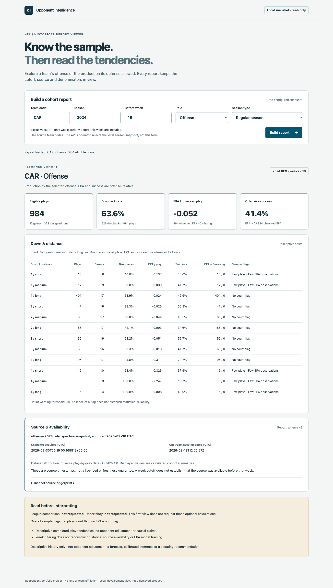

# Local report viewer

The first P1.4 browser slice is a React/TypeScript view of the existing
`GET /v1/report` endpoint, not a new analytics engine. It accepts team, season,
exclusive cutoff, offense/defense and regular/postseason selection. It displays
overall metrics, observed down/distance rows, sample flags, all report warnings,
source timestamps, attribution and fingerprints. It never selects a filesystem
path, fetches NFL data, or silently falls back to a synthetic response.



Screenshot captured from the real pinned snapshot via the local Vite proxy and
FastAPI service on 2026-10-09. This is retrospective CAR offense before REG week
19: 984 plays / 17 games, 626 dropbacks, -0.052 displayed EPA/play and 41.4%
displayed offensive success. Source acquisition was in 2026. This is not a live
feed, pregame-available dataset, performance benchmark or validated scouting advice.

## Start locally

Use Node **24.19.0** (`web/.nvmrc`) and Python 3.11–3.13. The frontend currently
supports Node 24.15+ within major 24; project-local engine enforcement rejects
unsupported versions. No global Node/npm settings are modified. Install/select
the runtime with your normal version manager, then check `node --version`.

First start the API using [the existing snapshot setup](API.md#install-and-start)
in one terminal. Its explicitly configured snapshot must already exist. Keep the
API on `127.0.0.1:8000`; the canonical pinned snapshot is still the example in that
guide, not a guarantee that today's upstream bytes match it.

In a second terminal, from the repository root:

```sh
cd web
npm ci
npm run dev
```

Open `http://127.0.0.1:5173/` and select **Build report**. Installation needs package
network access. Once dependencies and the snapshot exist, normal operation is
local: no hosted assets, remote fonts, acquisition or background report requests.
Stop the two terminal processes with Ctrl-C when finished.

The UI starts with CAR / 2024 / before week 19 / offense / REG as editable
example controls, not preloaded observations. A different configured season
returns an explicit API error until the controls match. Source codes are not
validated against a team registry: an absent but syntactically valid team can
produce an empty cohort, not proof of a real team.

## Local connection decision

Browser requests are same-origin `/api/v1/report?...`. Vite proxies only that exact
route to the fixed loopback API and strips `/api`. No client-selected backend URL,
general proxy, environment-based remote target, API CORS change or storage layer
was needed. Vite binds loopback on a fixed port, refuses port fallback and restricts
its asset allowlist to `web/`, not the surrounding repository/raw snapshots.

This is a **development** connection policy. Vite's build emits static assets, but
those files alone do not provide an API proxy. There is no production hosting
configuration, preview-server workflow, authentication or deployment in this unit.
Do not run either service on a public interface or override the localhost/file
restrictions as a deployment shortcut. Query limits are not a security boundary
for an internet-facing application. The existing single-snapshot, memory-resident
API does not justify adding a database for this view.

## Display and request contract

- Only the five query controls above are sent. The API's default warning threshold
  remains 30. This view does not request context ranges, league comparison or
  bootstrap uncertainty. Those calculations are labeled **not requested**, not
  zero, unavailable confidence, or evidence of no difference.
- The decoder checks the consumed schema v2 fields, returned cohort against the
  submitted query, offense-relative interpretation, metric shapes/count partitions,
  observed situation partitions, source hash consistency and UTC timestamps. Both
  `Z` and `+00:00`, including fractional seconds, are accepted. Unexpected filters
  or comparison/uncertainty blocks fail closed rather than being mislabeled or
  silently hidden. This is not a full independent validator of every report field
  or a statistical reimplementation.
- EPA keeps its sign in defense mode, where production is **allowed to opposing
  offenses**. Success remains offensive EPA > 0, not defensive stops. Dropback
  rates use all eligible plays; EPA and success use observed EPA only. Small-count
  flags are warnings, not significance or independence guarantees.
- Nulls display as **Unavailable**; observed zeroes remain zero. Percentages are
  rounded to one decimal and EPA to three for display only. The API values are not
  rounded or recomputed. A whole report may have observed EPA while an individual
  situation has none. Empty responses preserve provenance and warnings.
- Editing any control immediately removes old results and aborts the prior
  client request. A sequence guard also ignores late responses. Loading is
  announced, duplicate submit buttons are disabled, failures offer a manual retry,
  and a 15-second client timeout stops waiting. There are no automatic retries or
  refreshes. Client abort/timeout does **not** cancel the server's report builder.
- Local network/proxy failures, API busy/season errors, unreadable JSON and invalid
  responses have distinct visible feedback. Arbitrary server exception text is
  not echoed. Source labels and warnings render as text, not HTML/Markdown.
- Labels, native inputs, visible keyboard focus, a skip link, live status/alert
  regions, table headers/caption and a keyboard-focusable horizontal table support
  basic accessibility. This is not a screen-reader or WCAG conformance audit.

All detailed source/method/data-quality fields remain available in the API JSON;
this view intentionally summarizes a subset. No report downloads, situation
filters, comparison controls, interval visualizations or saved queries exist yet.

## Verification

```sh
cd web
npm ci
npm test
npm run build
```

The lockfile pins resolved packages and integrity hashes. Tests use jsdom/Testing
Library/Vitest with fetch mocked to reject unconfigured network calls. The three
committed synthetic API fixtures cover offense, defense and empty cohorts. They
are never a runtime fallback or bundled sample API. Python API CI regenerates them
through the actual endpoint with socket/acquisition access blocked and compares
them exactly, so changes on either side cannot silently leave stale test data.

From the repository root with optional API/test dependencies installed:

```sh
PYTHONPATH=src .venv/api/bin/python -m unittest discover -s tests_api -v
# Print freshly regenerated fixtures for an explicit, reviewed update:
PYTHONPATH=src .venv/api/bin/python -m tests_api.test_frontend_contract
```

The tiny fixture gzip uses stored blocks and a fixed OS byte to remove compressor
heuristic/platform variance. Its IDs, timestamps, observations and provenance are
invented and labeled as such. No raw nflverse download is required by any CI job.
The Python core stays dependency-free; frontend tools install only under `web/`.

On 2026-10-09, 51 frontend tests, type-check and build passed on Node 24.19.0.
The 21 API tests (including cross-layer fixture replay) passed on Python
3.11/3.12/3.13. A separate Chrome 154 loopback check against the pinned real snapshot
verified initial no-fetch state, CAR offense/defense, an empty cutoff, correct
984-play output, no page errors, no external page requests and 403 for access to
the surrounding repository through Vite. Desktop (1360px) and mobile (390px)
layouts were inspected; mobile document width stayed 390px with the table scrolling
inside its region. These browser checks are local evidence, not CI browser tests
or latency/load measurements. The screenshot is the actual desktop output.

Self-review found a real timestamp compatibility bug during the live check: only
`Z` was accepted initially, but acquisition emits `+00:00`. The decoder now supports
both, with regression coverage. Another test assumption was corrected: zero overall
EPA does not make every situation's EPA observed. Config tests run in Node rather
than jsdom so filesystem URL checks use the correct environment. Further review
added bucket-count partition and impossible-date checks, exact JSON media-type
handling, and an own-property guard for the safe error-message lookup. No report formulas,
API routes, source snapshot or daily automation were changed.

Primary references reviewed for this slice:
[Vite server/proxy and filesystem options](https://vite.dev/config/server-options),
[React request cleanup guidance](https://react.dev/learn/synchronizing-with-effects),
[Testing Library](https://testing-library.com/docs/react-testing-library/intro/),
[Vitest](https://vitest.dev/guide/), and
[setup-node](https://github.com/actions/setup-node).

## Next slice

Add an opt-in matched league comparison view, preserving actual baseline coverage,
matching down/distance buckets, null differences and percentage-point units. Keep
computation in the existing API. Broader context filters, uncertainty display,
downloads and a CI browser demo remain separate P1.4 work; do not mark the whole
product surface complete on the strength of this first viewer.
